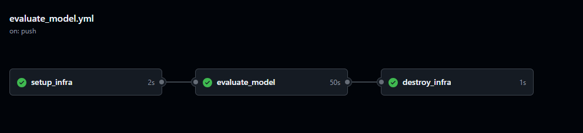

# auto-github-runner
Repository dedicated to the development of github workflow to automatically register an ephemeral github runner. <br>

<hr>
In some cases, free github runners may lack of "power" or do not meet specific requirements, this will help overcome this issue.  <br>

## How to use this code ? 

### 1. Settings
Repository secrets expected : 
```
- AWS_SECRET_KEY : AWS credentials 
- AWS_SECRET_KEY_ID : AWS credentials 
- EC2_KEY_NAME : EC2 key pair name
- EC2_PRIVATE_KEY : S3 path to your private key 
- GH_TOKEN : used to request the runner's registration token
```
## 2. Trigger the workflow

By making an API call :
```      
curl -L \
-X POST \
-H "Accept: application/vnd.github+json" \
-H "Authorization: Bearer $GH_TOKEN" \
-H "X-GitHub-Api-Version: 2022-11-28" \
https://api.github.com/repos/<your_org>/<infra_repo>/actions/workflows/register.yml/dispatches \
-d '{"ref":"main","inputs":{"repository":"${{ github.repository }}"}}'
```

Workflow Inputs : 
```
- repository : repository name (owner/repo_name) to which the runner will be affected to
- (optional) ami_id : ami id used for the instance creation 
- (optional) instance_type : instance type of 
```
** If you have an existing infrastructure you can just keep the ansible part of the repo and adapt the workflows files

## Example of usage 

Integration to the production code of a new AI model by evaluating it against your test dataset : <br>



** Please note that the infrastructure code is here to serve as an example for an easy setup, it is not recommended to use this for production. Or if you don't have a toaster as a computer, you can use Vagrant 🙃. 

## Cite and share
Please add the license to your work or add a star to the repository 😊

## Useful links

- Github API documentation: https://docs.github.com/en/rest/actions/self-hosted-runners?apiVersion=2022-11-28#create-a-registration-token-for-a-repository 
- Runner as a service setup: https://docs.github.com/en/actions/hosting-your-own-runners/managing-self-hosted-runners/configuring-the-self-hosted-runner-application-as-a-service